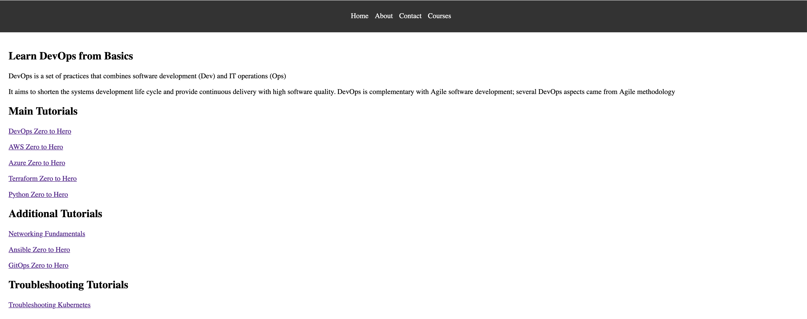

# Go Web Application

This is a simple website written in Golang. It uses the `net/http` package to serve HTTP requests.

## Running the server

To run the server, execute the following command:

```bash
go run main.go
```

The server will start on port 8080. You can access it by navigating to `http://localhost:8080/courses` in your web browser.

## Looks like this



# End-to-end GitOps Project using AWSEKS & ArgoCD

## Introduction 🌐
End-to-End GitOps Project Using AWS EKS & ArgoCD

This guide provides an end-to-end DevOps implementation for a Golang web application,
covering containerization, Kubernetes deployment, CI/CD pipelines, and GitOps with ArgoCD on AWS EKS.


## Project Flow Architecture
1. Installation and Setup <br>
o Install Golang, other dependencies, AWS CLI, EKS CTL, Kubectl, and Helm.
2. Containerization  <br>
o Create a multi-stage Dockerfile for the Golang web application.
3. Kubernetes Manifests  <br>
o Create deployment.yaml, service.yaml, and ingress.yaml files.

4. EKS Cluster Creation  <br>
o Use EKS CTL to create an EKS cluster on AWS.
5. Ingress Controller <br>
o Set up Nginx Ingress Controller for domain mapping and load balancing.
6. Helm Charts <br>
o Create Helm charts for Kubernetes manifests to enable multi-environment
support and facilitate GitOps.
7. Continuous Integration <br>
o Configure GitHub Actions for build, test, docker image creation, pushing to
DockerHub, and updating values.yaml.
8. Continuous Deployment <br>
o Set up ArgoCD for automated deployment of the latest Docker images from
DockerHub.

## Running the Go Application Locally

1. Build and Run <br>
go build -o main .
./main


2. Access the Application <br>
   o Visit http://localhost:8080/courses
  


## Writing a Multi-Stage Dockerfile
cd end-to-end-cicd-pipeline-for-go-web-app <br>
vi Dockerfile


## Build the Multi-Stage Dockerfile


docker build -t sumanprasad007/go-web-app:v1 . <br>
docker images
## Test the Docker Image
docker run -it -p 8080:8080 sumanprasad007/go-web-app:v1 <br>
## Push the Docker Image to DockerHub
docker push samsorrahman/go-web-app:v1

## Creating Kubernetes Manifests


## EKS Cluster Creation
Prerequisites<br>
• Kubectl: Install or update kubectl<br>
• EKS CTL: Install or update eksctl<br>
brew tap weaveworks/tap<br>
brew install weaveworks/tap/eksctl<br>
• AWS CLI: Install, update, and configure AWS CLI<br>
aws configure
## Create EKS Cluster
eksctl create cluster --name demo-cluster --region us-east-1


## Apply Kubernetes Manifests
kubectl apply -f k8s/manifests/deployment.yaml <br>
kubectl apply -f k8s/manifests/service.yaml<br>
kubectl apply -f k8s/manifests/ingress.yaml<br>


## Check Service Reachability
kubectl get svc <br>
kubectl edit svc go-web-app 
## Change type from ClusterIP to NodePort
kubectl get nodes -o wide<br>
Copy external IP and access http://<external-ip>:<nodePort>/courses

## Enable Ports in EKS Cluster Security Group
• Ensure necessary ports are open in the security group.


## Nginx Ingress Controller Setup
kubectl apply -f https://raw.githubusercontent.com/kubernetes/ingress-nginx/controllerv1.11.1/deploy/static/provider/aws/deploy.yaml


## Domain Mapping
sudo vi /etc/hosts
Add entry<br>
<external-ip> go-web-app.local<br>
• Access the application at http://go-web-app.local/courses.


## Helm Charts for Multi-Environment Deployment
Install Helm <br>
brew install helm<br>
helm version
helm create go-web-app-chart<br>
Helm Chart Structure<br>
• Charts: Metadata of the chart.<br>
• Templates: Kubernetes manifests.<br>
• Values.yaml: Environment-specific customization.<br>
## Push Code to GitHub
• Ensure code is pushed to a GitHub repository.
## Creating the CI/CD Pipeline with GitHub Actions

## Set up Secrets in GitHub Repository
• DOCKERHUB_USERNAME <br>
• DOCKERHUB_TOKEN <br>
• TOKEN

## GitHub Actions Workflow


## Continuous Deployment with ArgoCD
Install ArgoCD<br>
kubectl create namespace argocd<br>
kubectl apply -n argocd -f https://raw.githubusercontent.com/argoproj/argocd/stable/manifests/install.yaml


## Access ArgoCD UI
kubectl patch svc argocd-server -n argocd -p '{"spec": {"type": "LoadBalancer"}}'<br>
kubectl get svc argocd-server -n argocd

## Retrieve Initial Password
kubectl get secret argocd-initial-admin-secret -n argocd -o jsonpath="{.data.password}" |
base64 --decode<br>
• Log in to the ArgoCD dashboard with the retrieved password.


## GitOps with ArgoCD


• ArgoCD will monitor the Git repository and deploy the latest Docker image to the Kubernetes cluster whenever changes are detected.<br>
## Changes has been deployed to the Kubernetes cluster using the ArgoCD:


• Every time you make changes to the website, an automated process is triggered. This process builds the code, runs tests, creates a Docker image, uploads it to Docker Hub, and updates the deployment configuration with the new image tag. Argo CD continuously monitors for image tag changes and automatically deploys the updated image to the Kubernetes cluster, reflecting the website changes.


• Triggers the GitHub Action CI Pipelines:
<br>
• Argo CD continuously monitors for image tag changes and automatically deploys the updated image to the Kubernetes cluster


• Now, we can see it has updated our website:


